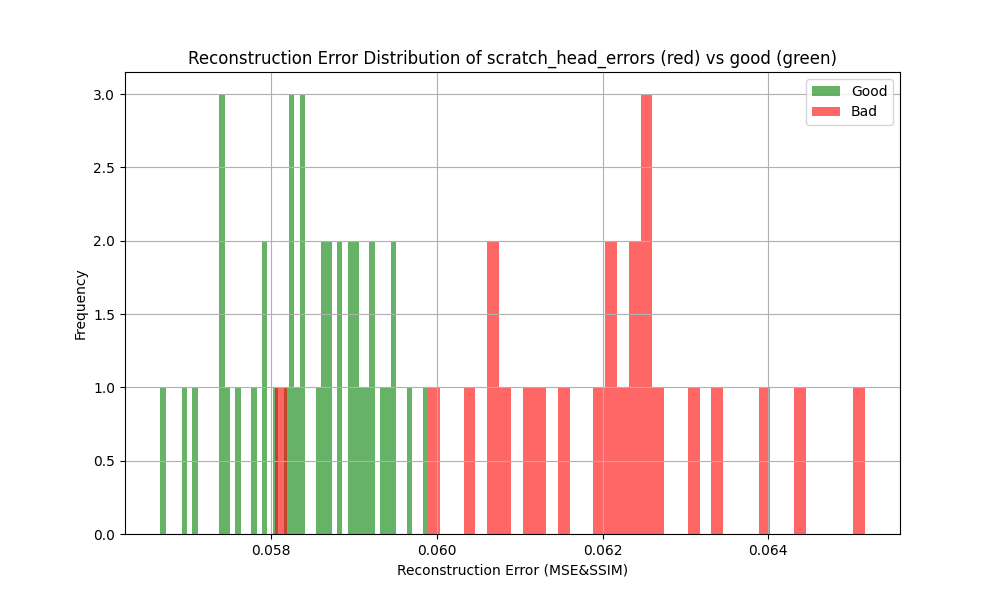
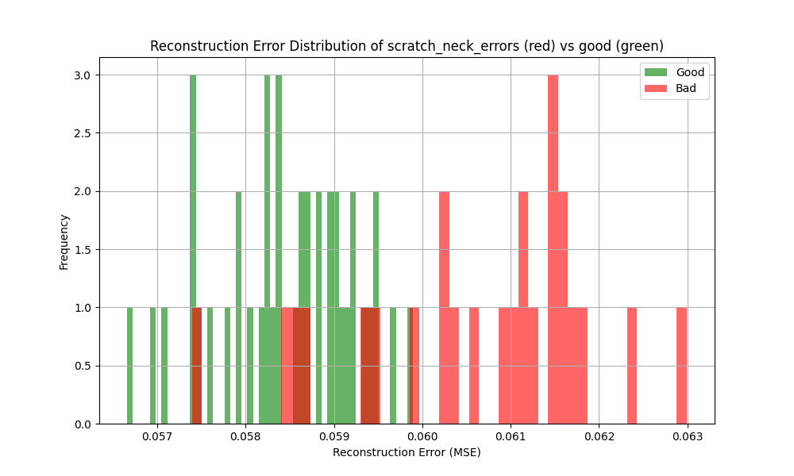
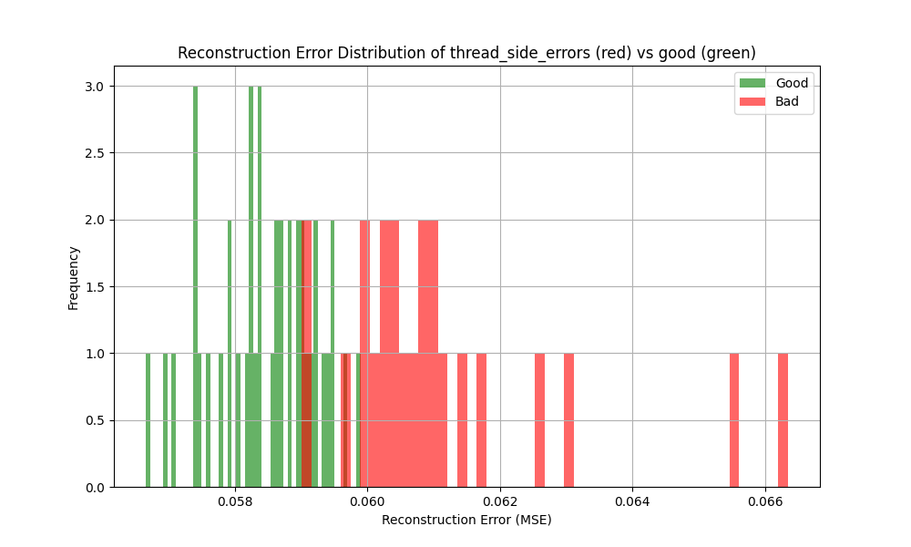
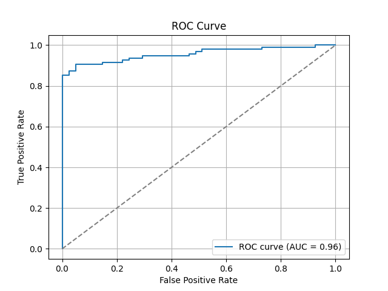

# Anomaly Detection with MVTec AD Dataset

This repository provides a full pipeline for anomaly detection using the [MVTec Anomaly Detection (AD)](https://www.kaggle.com/datasets/ipythonx/mvtec-ad) dataset. The project covers everything from data preprocessing, model training/testing with PyTorch, to plans for deployment via a REST API in a Docker container.

## Dataset

The MVTec AD dataset is a high-quality dataset for benchmarking industrial anomaly detection methods. It contains a variety of object and texture categories, with both normal and anomalous images.

Download it from: [Kaggle - MVTec AD](https://www.kaggle.com/datasets/ipythonx/mvtec-ad)

Place the dataset in a suitable directory (e.g., `./data/raw/`) before running preprocessing.

## Preprocessing

The preprocessing step prepares the MVTec AD dataset for model training. To run the preprocessing script:

```bash
python data/preprocess.py
```

## Model
* **Encoder**: 
    The encoder is composed of four convolutional layers. Each layer reduces the spatial dimensions of the input image while increasing the depth (number of feature maps). The encoder extracts high-level features from the image, which will later be used for reconstruction.
    * Conv1: Convolutional layer with 32 output channels.
    * Conv2: Convolutional layer with 64 output channels.
    * Conv3: Convolutional layer with 128 output channels.
    * Conv4: Convolutional layer with 256 output channels.
    After each convolutional layer, a Batch Normalization layer is applied to stabilize and speed up training, followed by a ReLU activation function to introduce non-linearity.

### Architecture Overview

The core model is based on a Convolutional Autoencoder architecture. It consists of an encoder-decoder structure aimed at reconstructing the input image while learning efficient feature representations of normal (non-anomalous) images.


The model can be found in model/pytorch_model.py. Im using a simple CNN Autoencoder approach. For a loss i utilized a combination of classic Mean Squared Error (MSE) and Structural Similarity Index Measure (SSIM) loss.

### Model Performance

The performances here are with a model that was trained for only 100 epochs of the training loop defined in the model script.

#### Reconstruction Error - Scratch Head


#### Reconstruction Error - Scratch Neck


#### Reconstruction Error - Thread Side


#### Reconstruction Error - Thread Top


| Defect Type          | Mean Error | Std Dev | Min Error | Max Error |
|----------------------|------------|---------|-----------|-----------|
| Scratch Head         | 0.0620     | 0.0015  | 0.0580    | 0.0652    |
| Scratch Neck         | 0.0606     | 0.0013  | 0.0574    | 0.0630    |
| Thread Side          | 0.0611     | 0.0018  | 0.0590    | 0.0663    |
| Thread Top           | 0.0613     | 0.0015  | 0.0591    | 0.0646    |

### ROC Analysis


Chosen reconstruction error threashold was 0.0595

## Deployment

The trained model can be deployed using a simple C++ HTTP server implementation. The server provides a single /infer POST endpoint for anomaly detection.

### Running the Inference Server

To build and run the server locally, follow these steps inside the deployment/ directory:

```bash
mkdir build
cd build
cmake ..
make
```

Once built, start the server:

```bash
./InferenceServer
```

By default, the server listens on 0.0.0.0:8080.
You can modify the listening address and port inside the server source code if needed.

The /infer POST endpoint expects a base64-encoded 1024x1024 image provided inside a JSON object under the key "image".
The server responds with a simple JSON containing a boolean value under the key "Anomaly", indicating whether an anomaly was detected.

### Running the Inference Server as a Docker Container

Alternatively, the inference server can be deployed as a Docker container.
To build the Docker image, execute the following inside the deployment/ directory:

```bash
docker build -t inference-server .
```

To run the image:

```bash
docker run -p 8080:8080 inference-server
```