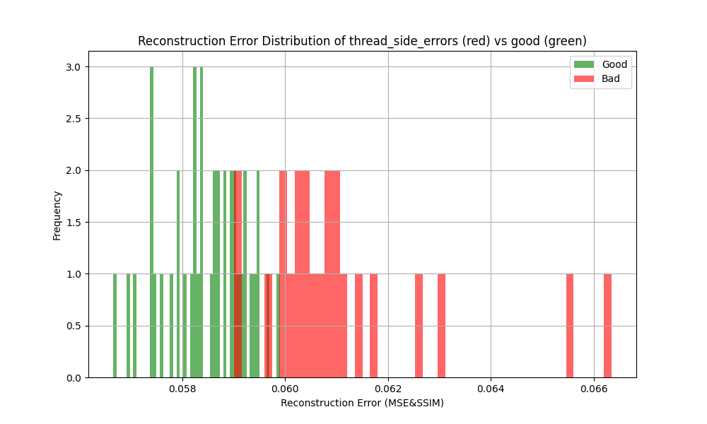
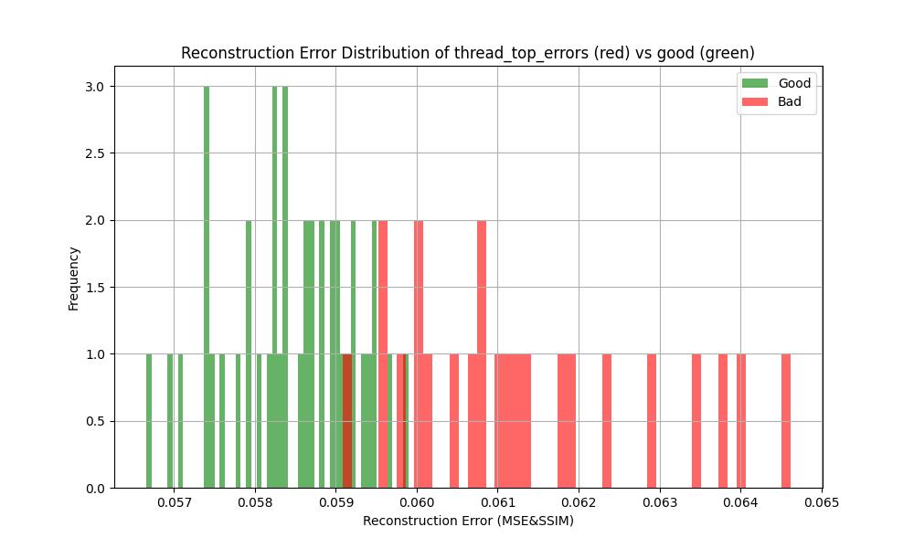

# Anomaly Detection with MVTec AD Dataset

This repository provides a full pipeline for anomaly detection using the [MVTec Anomaly Detection (AD)](https://www.kaggle.com/datasets/ipythonx/mvtec-ad) dataset. The project covers everything from data preprocessing, model training/testing with PyTorch, to plans for deployment via a REST API in a Docker container.

## Dataset

The MVTec AD dataset is a high-quality dataset for benchmarking industrial anomaly detection methods. It contains a variety of object and texture categories, with both normal and anomalous images.

Download it from: [Kaggle - MVTec AD](https://www.kaggle.com/datasets/ipythonx/mvtec-ad)

Place the dataset in a suitable directory (e.g., `./data/raw/`) before running preprocessing.

## Preprocessing

The preprocessing step prepares the MVTec AD dataset for model training. To run the preprocessing script:

```bash
python data/preprocess.py
```

## Model

The model can be found in model/pytorch_model.py. Im using a simple CNN Autoencoder approach. For a loss i utilized a combination of classic Mean Squared Error (MSE) and Structural Similarity Index Measure (SSIM) loss.

### Model Performance

The performances here are with a model that was trained for only 100 epochs of the training loop defined in the model script.

#### Reconstruction Error - Scratch Head


#### Reconstruction Error - Scratch Neck


#### Reconstruction Error - Thread Side


#### Reconstruction Error - Thread Top


| Defect Type          | Mean Error | Std Dev | Min Error | Max Error |
|----------------------|------------|---------|-----------|-----------|
| Scratch Head         | 0.0620     | 0.0015  | 0.0580    | 0.0652    |
| Scratch Neck         | 0.0606     | 0.0013  | 0.0574    | 0.0630    |
| Thread Side          | 0.0611     | 0.0018  | 0.0590    | 0.0663    |
| Thread Top           | 0.0613     | 0.0015  | 0.0591    | 0.0646    |

### ROC Analysis


Chosen reconstruction error threashold was 0.0595

## Deployment

The trained model can be deployed as a simple REST API. This APi is implemented with a light weight http server library, with a single POST endpoint.

### Running the Inference Server

In the deployment dir execute the following

```bash
mkdir build
cd build
cmake ..
make
```

Then run the server via

```bash
./InferenceServer
```

By default, the server listens on 0.0.0.0:8080. You can modify the listen andress and port. The POST endpoint "/infer" expects the 1024x1024 image to be encoded using base64 and the bas64 string to be in a json body under the key "image". The return type is just a simple boolean value in a json under the key "Anomaly".

### Running the Inference Server as a Docker Container

The inference server can also deployed via a Docker Container. The script to build the image is in the deployment dir. For the purpose of creating the image execute the following in the deployment dir

```bash
docker build -t inference-server .
```

Then run the inference-server image